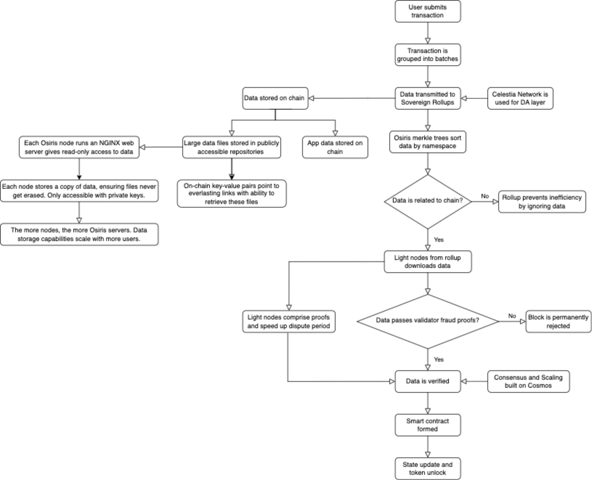

# Osiris
Built on Cosmos using Celestia, Osiris is a revolutionary app chain that provides zero-gas fee transactions to app builders, unparalleled storage capabilities, and the capacity to handle tens of thousands of transactions per second. Osiris is a
next-generation blockchain that will emerge as the primary tool in app development: allowing developers to store any form of data with no gas fees and extremely low operating costs. The OSRS token will serve as the native token on the Osiris protocol, enabling users to stake, burn, trade, pay auxiliary fees, and trade.

## Diagram

## Install

1. Clone this repo

